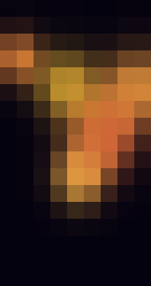
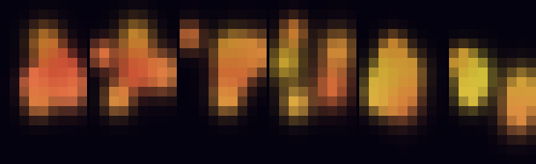
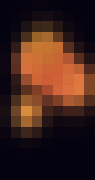

# Green Building Lava Lamp

A lava-lamp simulation for [MIT's Green Building](https://en.wikipedia.org/wiki/Green_Building_(MIT)) (Building 54): a 17×9 grid of windows that has been used as a giant RGB display, including the well-known [Tetris-on-a-building](https://www.anhadsawhney.com/green-building-tetris) installation.

Six heat-driven blobs rise from the warm bottom of the facade, cool and sink at the roof, merge, split, and blend. This client talks only to the HTTP simulator; it does not drive the physical radio modules in the building.







## Run

Requires Python 3.10+ and an existing simulator instance. No packages to install.

```sh
git clone https://github.com/Rhoahndur/green-building-lava-lamp.git
cd green-building-lava-lamp
python3 lava_lamp.py crisp-owl
```

Open https://sundai.willsarg.com/crisp-owl?view=close. Replace `crisp-owl` with the instance assigned to you. GitHub sign-in alone does not create an instance; use the name from the workshop host or simulator UI.

Runs continuously from your machine at up to 20 FPS; press Ctrl+C to stop. Keep the machine awake and connected. Only run one sender per instance. Any previously uploaded simulator clip resumes when live frames stop.

Watch it locally, with no instance, in a truecolor terminal:

```sh
python3 lava_lamp.py --preview --frames 0
```

## Options

| Option | Meaning |
| --- | --- |
| `--fps 30` | Target send rate **and** physics timestep (1–30). Seeded motion stays the same even if the network is slower. |
| `--seed 13` | Reproduce the same motion (the images above use this seed). |
| `--frames 200` | Stop after 200 frames. `0` means unlimited. |
| `--base-url http://localhost:8787` | Use another simulator host. |
| `--dry-run` | Validate locally without sending. Default length is 600 frames if `--frames` is omitted. |
| `--preview` | Draw each frame as an ANSI color grid on stderr. |
| `--dump-ppm DIR` | Write `frame-0001.ppm`, `frame-0002.ppm`, … into `DIR`. |
| `--dump-png PATH` | Write a 24× nearest-neighbor PNG of the last generated frame. |

`--preview`, `--dry-run`, and `--dump-*` do not need an instance.

```sh
python3 lava_lamp.py --dry-run --frames 180 --seed 13 --dump-png still.png
```

## Frame protocol

The client POSTs raw frames to the simulator. Neither [the Tetris software](https://www.anhadsawhney.com/green-building-tetris) nor a simulator checkout is required.

```
POST {base}/api/i/{instance}/frame
Content-Type: application/octet-stream
User-Agent: green-building-lava-lamp/2
```

- Body: **459 bytes**, row-major RGB (`17 rows × 9 columns × 3`).
- Origin: top-left. Row 0 is the roof; row 16 is the ground floor.
- Success: **HTTP 204**. 429 and 5xx are retried; other statuses abort.
- On a dropped connection the failed frame is skipped and a fresh one is generated.

## How the blobs work

The display is 9 windows wide and 17 floors tall. Each blob has position, velocity, radius, temperature, and a small hue offset around a slowly drifting base color.

| Knob | Default | Role |
| --- | --- | --- |
| Bottom heat / roof cooling | `ambient_temp(y)` | y increases downward; the ground floor is hot. |
| `HEAT_RATE` | 0.22 | How quickly a blob's temperature follows the air around it. |
| `BUOYANCY` | 3.4 | Hot blobs rise (toward y = 0); cold blobs sink. |
| `DRAG` | 0.55 | Caps terminal speed with `MAX_SPEED` (1.8). |
| `MERGE_FACTOR` | 0.32 | Overlapping blobs fuse and conserve area when more than `MIN_BLOBS` (5) are alive. |
| `SPLIT_RADIUS` / `SPLIT_TEMP` | 3.15 / 0.68 | Large hot blobs can split, up to `MAX_BLOBS` (7). |
| `HUE_SPREAD` / `HUE_DRIFT` | 0.1 / 0.004 | Analogous colors, full cycle ~4 minutes. |
| `BACKGROUND` | `(5, 2, 15)` | Dark fluid behind the glow. |
| `Y_ASPECT` | 0.85 | Windows are slightly taller than they are wide. |
| `GAUSS_FALLOFF` | 2.5 | Soft metaball edges. |

`--fps` sets `dt = 1/fps`. That is deliberate: `--seed 13 --fps 20` always produces the same frames. Most seeds are warm wax; about one in four is a teal set.

MIT licensed; see `LICENSE`.
